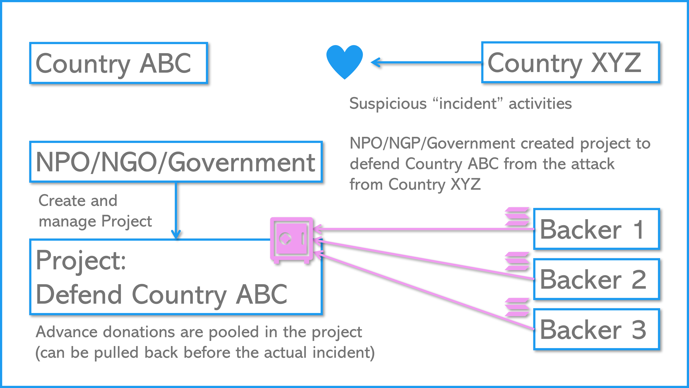
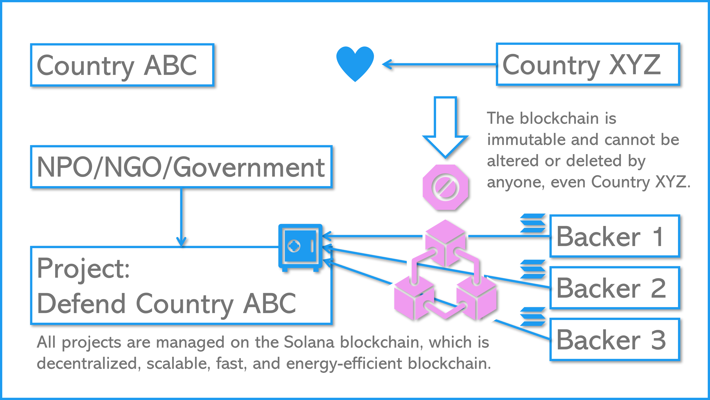
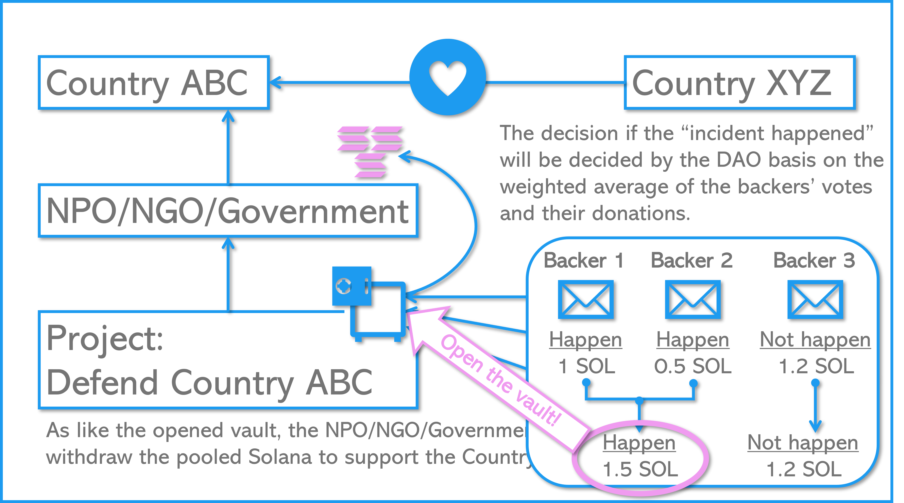

# Dove: Advance Donation using the blockchain


 

 

## Background

There are disasters, wars, and other matters that people wish to avoid beyond borders. Some of them are human-caused disasters that can be (still) delayed or avoided through human intervention, such as acts of invasion or rising temperatures caused by greenhouse effect gases. When these disastrous events (regrettably) occur, people sympathize, and in the spirit of mutual aid, one form of help is to donate money.

However, it is best to avoid the situation in the first place. What if there was an economic incentive to prevent incidents and continue peace or protect the global environment using donations? Furthermore, what if the amount of this donation had a deterrent effect on the other party? This campaign aims to provide incentives for continued contributions and to deter destructive actions by asking donations before the undesired event and withdrawing the fund when the event has been confirmed that it indeed happened.

### 1. The Basic Idea

First, the campaign will provide a place where people can donate depending on how much they wish to avoid a specific “incident.” Anyone can participate in this donation. Now, let us call the collected funds “advance donation.” If the “incident” actually occurs, an organization (aid group) that works to minimize the damage will receive this advance donation. Depending on the amount of donation, and knowing that the advance donation will go to an aid group may discourage the counter party. This aid group could be the invaded country or an NGO that promotes greenhouse gas mitigation. While this “incident” does not occur, the advance donation can be used for investment and its return could be used to provide further support to the aid group or reimburse donors for their contributions. While doners are already willing to donate, returns will incentivize those who wish to avoid the “incident” and continue to do so.

#### 1.1. Criteria of the “Incident”

There are two criteria for the ’incident’ in order to work. First, the “incident” should be avoidable by human effort. For example, earthquakes and tsunamis, for which there is no fundamental method to avoid, are not suitable. Where as acts of aggression between nations and rising temperatures due to greenhouse effects may be a fit. Second, the “incident” should be easy to confirm based on factual information. For example, “a landing of a missile” or “the difference in average temperatures in various regions.” However, examples show that facts get artificially manipulated via propaganda, so whether or not the “incident” has occurred will be determined by voting from the donor community.

#### 1.2 Transparancy and DAO

Regular donation campaigns require trust, and to build this trust, transparency of whether the donations got transferred correctly and the usage (not misappropriated) is critical. This campaign similarly requires trust during fund aggregation yet the trusted entity will be replaced with a smart contract. Transparency when voting for advance donation transfers, can also be met with this smart contract. In other words, it would be a DAO (Decentralized Autonomous Organization) for preventing man-caused catastrophes.

In addition to the approval of donation transfer, other topics also need consensuses, such as the ratio of votes required for approval (majority, 2/3, etc.), the selection of the recipient (which aid group?), and the vote collection processes. The DAO will also be the place for such discussions.

### 2 Mile stones

#### 2.1 MVP and the frontend

First, as an MVP, we will develop a place to aggregate advance donations and a voting mechanism to approve withdrawals. The key for this phase is to deploy the smart contract on devnet and develop the front end. The campaign will use the Solana blockchain 1, which is cheaper and faster than Ethereum. The system will use SOL (the primary currency used in the Solana blockchain) at this stage.

#### 2.2 Further DAO development

After the essential processes are in place, we will augment its function as a DAO. It should be able to handle quorum, percentage of affirmative votes required for withdrawal, amount of donations accepted, and operational policy. We will then have the smart contract audited to be prepared to be operated on the mainnet. We will also consider issuing the campaign’s own currency to control the number of donations and to decouple with the SOL price.(The base blockchain will continue to be Solana.)

#### 2.3 Lowening the barrier

The act of redeeming at a virtual currency exchange and installing a wallet on a device (or browser) for transactions on the blockchain is still considered a high barrier to participation. This is not limited to Solana.

Therefore, after the DAO is established, infrastructure to lower the participation barrier is important. Specifically, this will make it it easier to participate using legal tender such as dollars, euros and yen. The organization responsible for this function of connecting the blockchain to the common people will need to be legally registered.

---

## Development

### Environment

#### First Setup

1. Follow the below setup guide according to your platform. It would be the perfect guidance.
   - https://github.com/LearnWithArjun/solana-env-setup
1. You also can refer to each official installation guide regarding Rust and Solana as follows:
   - https://www.rust-lang.org/tools/install
   - https://docs.solana.com/cli/install-solana-cli-tools#use-solanas-install-tool

#### Update Solana

1. Run the solana-installer in a console to catchup/apply the latest updates
   > solana-install update
1. Or, you can use curl to install the latest version of the Solana CLI tools.
   > sh -c "$(curl -sSfL https://release.solana.com/v1.16.5/install)"
1. Verify the installation.
   > solana --version

#### Update Anchor

1. Install the Anchor version manager that is a tool for using multiple versions of the anchor-cli. It will require the same dependencies as building from source. It is recommended you uninstall the NPM package if you have it installed. Install avm using Cargo. Note this will replace your anchor binary if you had one installed.
   > cargo install --git https://github.com/project-serum/anchor avm --locked --force
1. On Linux systems you may need to install additional dependencies if cargo install fails. E.g. on Ubuntu:
   > sudo apt-get update && sudo apt-get upgrade && sudo apt-get install -y pkg-config build-essential libudev-dev
1. Install the latest version of the CLI using avm, and then set it to be the version to use.
   > avm install latest<br>
   > avm use latest
1. Verify the installation.
   > anchor --version

#### Make your own branch and setup the enviornment

1. Fork the repo to your account and clone the forked repo to your local laptop.
1. Install yarn
   > sudo apt install cmdtest
1. Install the dependencies
   > yarn install
1. Generate your wallet to deploy the program to Solana block chain.
   > solana-keygen new -o ./id.json
1. Check the address of your wallet.
   > solana address -k ./id.json
1. Run the Solana local validator node for testing in the different console window.
   > solana-test-validator
1. Airdrop at least 6 SOL to deploy the program to the localnet.
   > solana airdrop 2 `YOUR WALLET ADDRESS`
1. Then build the program with Anchor.
   > anchor build
   - This step could occur many troubles, please refer [Troubleshoot section](#Troubleshoot) to check the previous lessons learned.
   - If you cannot find the solution, google with your error message on your console to find the answer and put it in that section to solve it immediately the next time! This should be not only for others but also for yourself who can face the same issue again.
1. Check the Program Account address.
   > solana address -k ./target/deploy/dove-keypair.json
1. Copy & paste your Program Account addresses. E.g., if the address was `HCe8d6dZzxnLGuqtiKNERShgnVSVf6txrDmyCQEQdmTN`, you should update the addresses in the below three parts of the files.
   - ./Anchor.toml

     ```
     [programs.localnet]
     dove = "HCe8d6dZzxnLGuqtiKNERShgnVSVf6txrDmyCQEQdmTN"

     [programs.devnet]
     dove = "HCe8d6dZzxnLGuqtiKNERShgnVSVf6txrDmyCQEQdmTN"
     ```

   - ./programs/dove/src/lib.rs

     ```
     use instructions::*;

     declare_id!("HCe8d6dZzxnLGuqtiKNERShgnVSVf6txrDmyCQEQdmTN");

     #[program]
     pub mod dove {
     ```
1. Rebuild the program again with the updated address.
   > anchor build
1. Run Anchor Test by skipping to boot the local validator node in the other console.
   > anchor test --skip-local-validator
1. If the error occurred by the inconsistency with the cached key pair, recover/update the cached key pair with the below command and the shown 12-word seed phrase.

   > solana-keygen recover --force

   - The error message could be:

     ```
     Deploying workspace: http://localhost:8899
     Upgrade authority: ./id.json
     Deploying program "dove"...
     Program path: /home/ohsugi/dove-dev/target/deploy/dove.so...
     =====================================================================
     Recover the intermediate account's ephemeral keypair file with
     `solana-keygen recover` and the following 12-word seed phrase:
     =====================================================================
     coyote twin dish round acid talk marble arch stuff review turn unique
     =====================================================================
     To resume a deploy, pass the recovered keypair as the
     [BUFFER_SIGNER] to `solana program deploy` or `solana program write-buffer'.
     Or to recover the account's lamports, pass it as the
     [BUFFER_ACCOUNT_ADDRESS] argument to `solana program close`.
     =====================================================================
     Error: Deploying program failed: Error processing Instruction 1: custom program error: 0x1
     There was a problem deploying: Output { status: ExitStatus(unix_wait_status(256)), stdout: "", stderr: "" }.
     ```

   - In this case `12-word seed phrase` would be `coyote twin dish round acid talk marble arch stuff review turn unique`.

#### Troubleshoot

- Error message like "error while loading shared libraries: libssl.so.1.1: cannot open shared object file: No such file or directory".
  - https://github.com/solana-labs/solana/issues/22404
  ```
  rm -rf ~/.local/share/solana
  rm -rf ~/.config/solana
  rm -rf ~/.cache/solana
  sh -c "$(curl -sSfL https://release.solana.com/stable/install)"
  ```
- Error message like "error while loading shared libraries: libssl.so.1.1: cannot open shared object file: No such file or directory".
  - https://github.com/solana-labs/example-helloworld/issues/470
  ```
  wget http://nz2.archive.ubuntu.com/ubuntu/pool/main/o/openssl/libssl1.1_1.1.1f-1ubuntu2.19_amd64.deb
  sudo dpkg -i libssl1.1_1.1.1f-1ubuntu2.19_amd64.deb
  ```

### Test on the Localnet

1. Install ts-mocha if not installed yet.
   > npm install --global ts-mocha
   > npm install --global typescript
1. Configure the CLI Tool Suite to target a local cluster by default.
   > solana config set --url localhost
1. Run the Solana local validator node for testing in a console window.
   > solana-test-validator
1. Or, you want to reset validator data, run the below command.
   > solana-test-validator -r
1. Run Anchor Test by skipping to boot the local validator node in the other console.
   > anchor test --skip-local-validator

## Consideration

- Strategy to pull the pooled amount from DoveCampaign.
  1. The admin needs actively check the privilege and pull the amount from DoveCampaign by following steps.
  1. Fetch all DoveFund regarding the targeted DoveCampaign to calculate parameters of amount_pooled, and update_date.
  1. Check the consistency of those parameters with the targeted DoveCampaign.
  1. If consistent and the decision is larger than the threshold (currently 50% = 0.5), the DoveCampaign will be marked to pull the amount from the DoveFund and record its last_date_transferred property with the latest unix time.
  1. If the targeted DoveCampaign is marked, the admin will ask each DoveFund to pull the amount with the specific instruction.
  1. Each DoveFund then compares its last_date_transferred with the DoveCampaign if that is older than the DoveCampaign one, the amount pooled will be transferred to the admin and updated last_date_transferred property. That instruction also will update DoveCampaign's amount_pooled property.
  1. The admin will do the instruction among all fetched DoveFund until the pooled amount is not zero (some funds are remaining in one or more DoveFund) so that the admin can pull all amounts from the DoveFund.
  1. During this process, is_locked flag might be used to lock any operations to the DoveCampaign and the related DoveFund.
- The objective of the campaign-based funding system instead of the specific target country
  - The appropriate recipient's wallet Pubkey can directly support the target country, it would be a self-declaration to register the wallet Pubkey and start the campaign by themselves.
- The ideas, use cases, and ultimate peace are our core interests, so we want to operate Dove from a neutral position in terms of countries' interests and political beliefs.
  - Even if we launch Dove only for some specific countries, some hostile countries to them can take the same approach and launch the same system to secure their profits as a country activity.
  - People will ask for investment as their campaign will be motivated by promoting their campaign and Dove itself. It could notify the other people and get their attention on the SNSs.
- Intention to limit use to “Peacekeeping” only for this system
  - We can abstract Vote as the Postpaid Crowdfunding system, in which the pooled amount will be transferred once the investors decided that something has been realized (for example, "a certain country has been attacked from the other country(ies)").
  - This idea itself can be applied to other use cases, and we can develop Dove to allow users ultimately for any purposes as well.
  - Restricting the method of use makes the explanation more straightforward and clearer, and is thought to be more approachable for users.
  - Basically, if the use cases would be simple crowdfundings, we need no Blockchain as the backend.
- Uses of the pooled SOL
  - Just for an example idea, automatically stake half of the entire pooled amount and earn a profit for retaining sustainable maintenance.
  - Earn a small portion as a margin from the transaction to retain the sustainable development and operating expenses.
  - The rest of the margins from the profit will be distributed to all investors proportionally according to the investment ratio to encourage keeping pooling their SOLs to Dove.
- Social Media URL link to prove the identification
  - Even if the users will show their Wallets Pubkeys, no one can confirm the exact identity from that information.
  - For example, even if you claim to be a government official or an NGO/NPO that delivers relief supplies, other companies cannot easily confirm it.
  - The potential way to allow the users to evaluate the other users' identities by themselves, is each user can submit a post related to Dove on whatever social media, and register the link to such a post from Dove.
  - And the people can evaluate if that identity would be appropriate to support the targeted country, and the users can be encouraged to pool their funds on their campaign.
  - This method can be good for the users to promote their campaign and Dove itself because the users can notify the other people and get their attention on the social media.

## Architecture

- Frontend
  - Flutter
  - Dart
- Backend
  - Rust
  - Anchor
- Blockchain
  - Solana
  - Phantom Wallet
- Deployment
  - GitHub
  - GitHub Pages

## Account Specification

- **DoveCampaign**

  - **admin_pubkey**: Pubkey: Admin Wallet pubkey
  - **evidence_link**: String: Hyper link to show the other users to make sure the admin's identity
  - **campaign_name**: String: Campaign Name
  - **target_country_code**: String: Target Country code (defined in the iso_country::Country)
  - **opponent_country_code**: String: Opponent Country code (defined in the iso_country::Country)
  - **description**: String: Campaign description
  - **created_date**: i64: Campaign created date (unix-time stamp)
  - **update_date**: i64: Campaign last update date (unix-time stamp)
  - **is_locked**: bool: Campaign Effective flag
  - **is_deleted**: bool: Campaign Delete flag
  - **video_link**: String: Video link to describe the campaign as string (intended Youtube)
  - **amount_pooled**: u64: The current pooled amount (as Lamports)
  - **amount_transferred**: u64: The amount transferred so far (as Lamports)
  - **decision**: u64: The current decision for this campaign
  - **last_date_transferred**: i64: The last date time pooled amount was transferred (unix-time stamp)
  - **bump**: u8: The bump number to avoid the duplicated PDA address

- **DoveFund**

  - **campaign_pubkey**: Pubkey: The target campaign pubkey
  - **user_pubkey**: Pubkey: The founder's Wallet pubkey
  - **amount_pooled**: u64: The current pooled amount
  - **amount_transferred**: u64: The transferred amount so far
  - **decision**: f32: The decision percentage
  - **shows_user**: bool: If the user will be shown on the campaign webpage
  - **shows_pooled_amount**: bool: If the user's pooled amount on the campaign webpage
  - **shows_transferred_amount**: bool: If the user's transferred amount on the campaign webpage
  - **created_date**: i64: Fund craetion date (as Unix Time)
  - **update_date**: i64: Fund update date (as Unix Time)
  - **bump**: u8: The bump number to avoid the duplicated PDA address

- **DoveUser**
  - **user_pubkey**: Pubkey: Wallet pubkey
  - **user_name**: String: User name
  - **social_media_link**: String: Social media links of the user
  - **evidence_link**: String: HTML link to prove own identity
  - **is_shown: bool**: The profile will be shown on each campaign webpage
  - **created_date**: i64: User craetion date (as Unix Time)
  - **update_date**: i64: User update date (as Unix Time)
  - **bump**: u8: The bump number to avoid the duplicated PDA address

## Front-end Development

- https://github.com/ohsugi/dove-frontend

  ## Credit

- Arjun: https://github.com/LearnWithArjun
